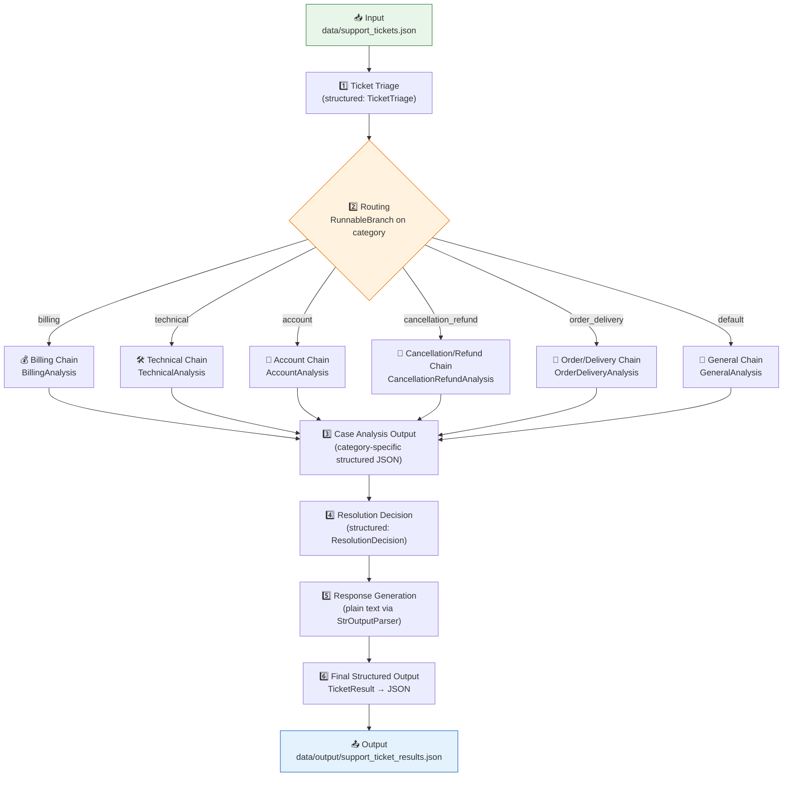
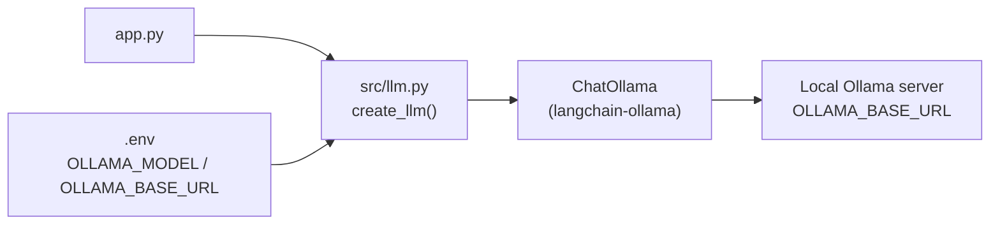

<div align="center">

# 🧩 ResolveFlow-AI

### A Multi-Stage LangChain Engine for Intelligent Support Ticket Routing & Resolution

*Turning a raw customer message into a triaged, analyzed, decisioned, and drafted support reply — through six composable LCEL stages.*

[](https://www.python.org/)
[](https://www.langchain.com/)
[-000000?style=flat)](https://ollama.com/)
[](https://docs.pydantic.dev/)
[](./LICENSE)

</div>

---

## 📖 Project Overview

**ResolveFlow-AI** is a multi-stage LLM orchestration engine that automates end-to-end customer support ticket processing. Instead of a single monolithic prompt asking an LLM to "handle this ticket," the system decomposes the problem into **six discrete, independently testable stages** — each with its own prompt, its own responsibility, and (for five of the six) its own **Pydantic-validated structured output**.

Given a batch of raw support tickets (JSON), the engine:

1. Classifies each ticket (category, priority, language)
2. Routes it to a **category-specialized analysis chain**
3. Extracts structured, category-specific case details
4. Decides the correct resolution path
5. Drafts a customer-facing reply that **follows** that decision (never invents its own)
6. Emits a fully structured JSON result ready for storage or downstream integration

The project is built entirely on **LangChain's Runnable / LCEL primitives** — no framework magic, no hidden agents — making the control flow explicit and easy to reason about.

---

## 🤔 Why This Project?

Most "AI support bot" tutorials wire a single prompt straight to an LLM and call it a day. That approach breaks down in practice because:

- A billing ticket and a technical ticket need **completely different extraction fields** — one flat prompt can't specialize.
- Letting one LLM call both **decide** the resolution *and* **write** the reply invites the model to silently change its own decision mid-sentence.
- Unstructured text output is unusable for downstream systems (ticketing tools, CRMs, analytics).

ResolveFlow-AI was built to demonstrate how these problems are actually solved in production-style LLM systems: **stage separation, structured contracts between stages, and explicit routing** — using nothing but core LangChain building blocks.

---

## ✨ Key Features

| Feature | Description |
|---|---|
| 🧭 **Category-based routing** | A `RunnableBranch` inspects the triage output and routes the ticket to one of six specialized analysis chains |
| 📐 **Structured output everywhere** | Every stage except the final reply returns a validated Pydantic model via `with_structured_output()` |
| 🧩 **One factory, six chains** | A single parametrized chain-builder (`_create_analysis_chain`) generates all six category chains from one shared prompt template + a per-category focus map — no duplicated prompt logic |
| ⚖️ **Decision/generation separation** | The *resolution decision* and the *customer reply* are two separate chains — the reply chain is explicitly instructed not to alter the decision that was already made |
| 📝 **File-based prompt management** | Prompts live as plain `.txt` files under `/prompts`, loaded at runtime — editable without touching Python code |
| 🖥️ **Local LLM inference** | Runs entirely on a local **Ollama** model via `langchain-ollama` — no cloud API key, no per-token cost |
| 🛡️ **Per-ticket fault isolation** | If one ticket fails mid-pipeline, the batch run logs the error and continues rather than crashing |
| 📦 **Structured batch pipeline** | Reads a JSON list of tickets, processes each through the full pipeline, and serializes all `TicketResult` objects back to disk |

---

## 🏗️ System Architecture



**LLM Backend:**



---

## 🔄 Multi-Stage Workflow / Pipeline

```
Support Ticket
      │
      ▼
Stage 1 — Triage           →  category, priority, language
      │
      ▼
Stage 2 — Category Routing →  RunnableBranch selects the matching analysis chain
      │
      ▼
Stage 3 — Case Analysis    →  category-specific structured details
      │
      ▼
Stage 4 — Resolution       →  resolution_type, recommended_action, requires_human, reason
      │
      ▼
Stage 5 — Response         →  customer-facing reply text
      │
      ▼
Stage 6 — Final Output     →  TicketResult (structured JSON, saved to disk)
```

Each arrow is a real handoff in code: the output of one stage is passed as *input variables* into the next stage's prompt (see `src/workflow.py::process_ticket`), so every downstream stage has full context from every upstream stage.

---

## ⚙️ How the Ticket Routing & Resolution Process Works

1. **`create_traige_chain(llm)`** loads `prompts/classification_prompt.txt`, binds it to `ChatPromptTemplate`, and pipes it into `llm.with_structured_output(TicketTriage)` — returning a validated `category`, `priority`, and `language`.
2. **`create_router(llm)`** builds a `RunnableBranch` with one lambda-guarded branch per category (`billing`, `technical`, `account`, `cancellation_refund`, `order_delivery`), falling back to the **general chain** by default. The branch condition simply checks `x["category"]`.
3. Each category branch is produced by the shared **`_create_analysis_chain(llm, category, schema)`** helper, which loads the *same* `prompts/case_analysis_prompt.txt` template but injects a category-specific `analysis_focus` checklist via `prompt.partial(...)`, and pairs it with that category's dedicated Pydantic schema (`BillingAnalysis`, `TechnicalAnalysis`, etc.).
4. The resulting case analysis is serialized with `model_dump_json()` and fed — along with the original triage — into **`create_resolution_chain(llm)`**, which returns a `ResolutionDecision` (`resolution_type`, `recommended_action`, `requires_human`, `reason`).
5. **`create_response_chain(llm)`** takes the full context *plus* the resolution decision and generates the customer-facing reply. The prompt explicitly instructs the model: *"Do NOT invent a new business decision. Do NOT change the resolution_type."* — enforcing a hard separation between deciding and writing.
6. Everything is assembled into a single **`TicketResult`** Pydantic object and appended to the batch output list.

---

## 🧠 AI/LLM Architecture

- **Model runtime:** `ChatOllama` from `langchain-ollama`, configured entirely through environment variables (`OLLAMA_MODEL`, `OLLAMA_BASE_URL`) via `python-dotenv` — the system runs against **any locally hosted Ollama model**, with `temperature=0` for deterministic, reproducible classification and decisions.
- **Structured generation:** Five of six pipeline stages use `.with_structured_output(<PydanticModel>)`, meaning the LLM's output is parsed and validated against a schema *before* it ever reaches downstream logic — eliminating brittle regex/JSON-parsing of raw model text.
- **Free-text generation, deliberately isolated:** Only the final customer-reply stage uses plain string output (`StrOutputParser`), since prose is the right output type there — not a design gap, but an intentional exception.
- **Prompt/code separation:** All prompt text lives in `/prompts/*.txt`, loaded at runtime by `load_prompt()` in `src/chain.py`, so prompt iteration doesn't require touching orchestration code.

---

## 🔗 LangChain Components & Techniques Used

| Component | Where it's used | Purpose |
|---|---|---|
| **LCEL (`\|` pipe operator)** | Every chain in `src/chain.py` | Compose `prompt → structured_llm` (or `prompt → llm → parser`) into a single `Runnable` |
| **`ChatPromptTemplate.from_template`** | All 4 prompt files | Turn raw `.txt` prompt files into templated, variable-driven prompts |
| **`.partial()`** | `_create_analysis_chain` | Pre-bind `category` and `analysis_focus` into the shared case-analysis template without repeating prompt files six times |
| **`RunnableBranch`** | `create_router` | Conditional, category-based routing to one of six specialized chains |
| **`with_structured_output(Schema)`** | Triage, all 6 analysis chains, resolution chain | Force schema-validated Pydantic output directly from the LLM |
| **`StrOutputParser`** | Response generation chain | Plain-text output for the customer-facing reply |
| **Pydantic v2 models** | `src/schemas.py` | Define the structured contract for every stage *and* double as the final serialization format (`model_dump()`) |

---

## 📁 Project Structure

```
ResolveFlow-AI/
├── app.py                        # Entry point: loads tickets, builds workflow, runs the batch
├── requirements.txt              # langchain, langchain-ollama, langchain-core, pydantic, python-dotenv
├── README.md
├── LICENSE                       # MIT
├── .gitignore
│
├── data/
│   ├── support_tickets.json      # Sample input batch (10 tickets)
│   └── output/                   # Generated at runtime — support_ticket_results.json
│
├── prompts/
│   ├── classification_prompt.txt     # Stage 1 — Triage
│   ├── case_analysis_prompt.txt      # Stage 3 — shared template for all 6 categories
│   ├── resolution_prompt.txt         # Stage 4 — Resolution decision
│   └── response_prompt.txt           # Stage 5 — Customer reply
│
└── src/
    ├── __init__.py
    ├── llm.py                    # create_llm() — ChatOllama setup from .env
    ├── chain.py                  # All chain factories + RunnableBranch router
    ├── schemas.py                # Pydantic models for every stage
    └── workflow.py                # build_workflow() + process_ticket() orchestration
```

---

## 🛠️ Technology Stack

| Category | Technology |
|---|---|
| **Programming Language** | Python 3.10+ |
| **LLM Orchestration** | LangChain (`langchain`, `langchain-core`) |
| **LLM / Model Serving** | Ollama (local inference) via `langchain-ollama` |
| **Structured Output / Validation** | Pydantic v2 |
| **Configuration** | `python-dotenv` (`.env`-based config) |
| **Data Format** | JSON (input tickets & output results) |
| **Prompt Management** | Plain-text prompt files (`/prompts/*.txt`), loaded and templated at runtime |

---

## 🚀 Installation & Setup

### Prerequisites
- Python 3.10+
- [Ollama](https://ollama.com/) installed and running locally
- An Ollama model pulled locally, e.g.:
  ```bash
  ollama pull llama3.1
  ```

### Setup

```bash
# 1. Clone the repository
git clone https://github.com/somasriman07/ResolveFlow-AI.git
cd ResolveFlow-AI

# 2. Create and activate a virtual environment
python -m venv venv
source venv/bin/activate      # Windows: venv\Scripts\activate

# 3. Install dependencies
pip install -r requirements.txt
```

---

## 🔐 Environment Configuration

Create a `.env` file in the project root (this file is git-ignored and **must be created manually** — no template is committed):

```env
OLLAMA_MODEL=llama3.1
OLLAMA_BASE_URL=http://localhost:11434
```

`src/llm.py` reads both variables at startup and will exit with a clear error message if either is missing.

---

## ▶️ How to Run the Project

Make sure your Ollama server is running, then:

```bash
python app.py
```

This will:
1. Load all tickets from `data/support_tickets.json`
2. Build the workflow chains once (reused across all tickets)
3. Run each ticket through all six pipeline stages, printing progress to the console
4. Save the full batch of structured results to `data/output/support_ticket_results.json` (directory created automatically)

---

## 💡 Example Input / Output

**Input** (`data/support_tickets.json`):

```json
{
  "ticket_id": "TKT-1001",
  "customer_name": "Rahul Sharma",
  "ticket": "I was charged twice for my Premium subscription this month. The amount is $29.99 each time. Please refund one of the duplicate charges."
}
```

**Output shape** (illustrating the `TicketResult` schema produced at Stage 6):

```json
{
  "ticket_id": "TKT-1001",
  "customer_name": "Rahul Sharma",
  "category": "billing",
  "priority": "High",
  "language": "English",
  "case_summary": "{ \"issue\": \"...\", \"amount\": 2999, \"transaction_count\": 2, \"refund_required\": true }",
  "resolution_type": "resolve",
  "recommended_action": "Issue a refund for one duplicate charge of $29.99.",
  "requires_human": false,
  "resolution_reason": "Clear duplicate billing case with sufficient evidence to resolve directly.",
  "response": "Hi Rahul, thank you for reaching out and I'm sorry for the inconvenience..."
}
```

---

## 🧭 Design Decisions / Engineering Highlights

- **One factory, six chains** — `_create_analysis_chain()` is called once per category with a different `(category, schema)` pair, eliminating six near-duplicate prompt/chain definitions.
- **Decision and generation are separate Runnables** — `ResolutionDecision` is produced by one chain and consumed (read-only) by another. This mirrors a real production pattern: business logic should never be re-derived inside a text-generation step.
- **Prompts as data, not code** — every prompt is an editable `.txt` file, loaded via a small `load_prompt()` utility with project-root-relative resolution, so prompt tuning doesn't require redeploying code.
- **Build once, reuse per ticket** — `build_workflow(llm)` constructs all chains a single time in `app.py`; the batch loop reuses the same `Runnable` instances for every ticket instead of rebuilding chains repeatedly.
- **Fault-tolerant batch loop** — `app.py` wraps each ticket's processing in a `try/except`, logging the failure and continuing rather than aborting the entire run.
- **Local-first inference** — using `ChatOllama` with `temperature=0` keeps the whole pipeline runnable offline, with no external API key and deterministic classification/decision behavior.

---

## 🧗 Challenges & Solutions

| Challenge | Solution |
|---|---|
| Six ticket categories need different extracted fields, but writing six full prompts is repetitive and hard to maintain | Built one shared `case_analysis_prompt.txt` template and injected a per-category `analysis_focus` checklist via `prompt.partial()` |
| Letting a single LLM call both decide *and* phrase the reply risks the model silently overriding its own decision | Split into two chains, with the response prompt explicitly forbidden from changing `resolution_type` |
| Raw LLM text output is unreliable to parse downstream | Used `with_structured_output()` with Pydantic schemas at every decision-bearing stage |
| A single malformed/edge-case ticket could crash an entire batch run | Wrapped per-ticket processing in `try/except` inside the `app.py` main loop |

---

## 🔮 Future Enhancements

> The following are **not yet implemented** — listed here for transparency and roadmap clarity.

- 🌐 REST API layer (e.g. FastAPI) to expose the pipeline as a service instead of a batch CLI script
- 🗄️ Persistent storage (database) instead of flat JSON input/output
- 🔁 Multi-provider LLM support (swap `ChatOllama` for `ChatOpenAI` / `ChatAnthropic` behind the same `create_llm()` interface)
- 🧠 LangGraph-based stateful workflow with retries, conditional loops, and human-in-the-loop checkpoints
- ✅ Automated test suite / evaluation harness for classification and resolution accuracy
- 🐳 Docker containerization for reproducible deployment
- ⚙️ CI/CD pipeline (lint, test, build)
- 📊 A results dashboard / analytics layer over processed tickets
- 🔍 Confidence scoring on routing decisions with automatic fallback to human review

---

## 🎯 Use Cases

- Automating first-line triage and drafting for a SaaS company's support inbox
- Prototype backend for an internal IT helpdesk ticket classifier
- A reference implementation for teams evaluating **local, cost-free LLM inference** for structured business workflows
- A teaching example of LCEL-based multi-stage orchestration with strict separation of concerns

---

## 🌟 Why This Project Is Different

Unlike many "AI ticket bot" demos that wrap a single prompt around an LLM call, ResolveFlow-AI is built the way a production support-automation service would actually be structured:

- **Structured contracts, not string parsing** — nearly every stage returns a validated Pydantic object, not raw text to be regex'd apart.
- **Decisions and language generation are architecturally separate** — a deliberate, enforced boundary rather than a convention hoped for in a prompt.
- **Runs entirely on local inference** — no cloud LLM dependency or per-request cost, demonstrating that the *architecture*, not a specific vendor API, is the point.
- **One reusable pattern generates six specialized chains** — avoiding the copy-paste sprawl common in tutorial-grade ticket routers.

---

## 👤 Author / Contact

**Sriman Soma**
B.Tech, Artificial Intelligence and Data Science — IIIT Sri City

- GitHub: [@somasriman07](https://github.com/somasriman07)
- Project: [ResolveFlow-AI](https://github.com/somasriman07/ResolveFlow-AI)

---

<div align="center">

*Built as a hands-on exploration of LangChain's Runnable/LCEL architecture, structured output, and multi-stage LLM orchestration.*

</div>